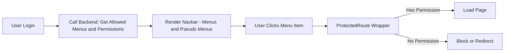
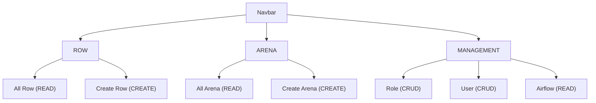
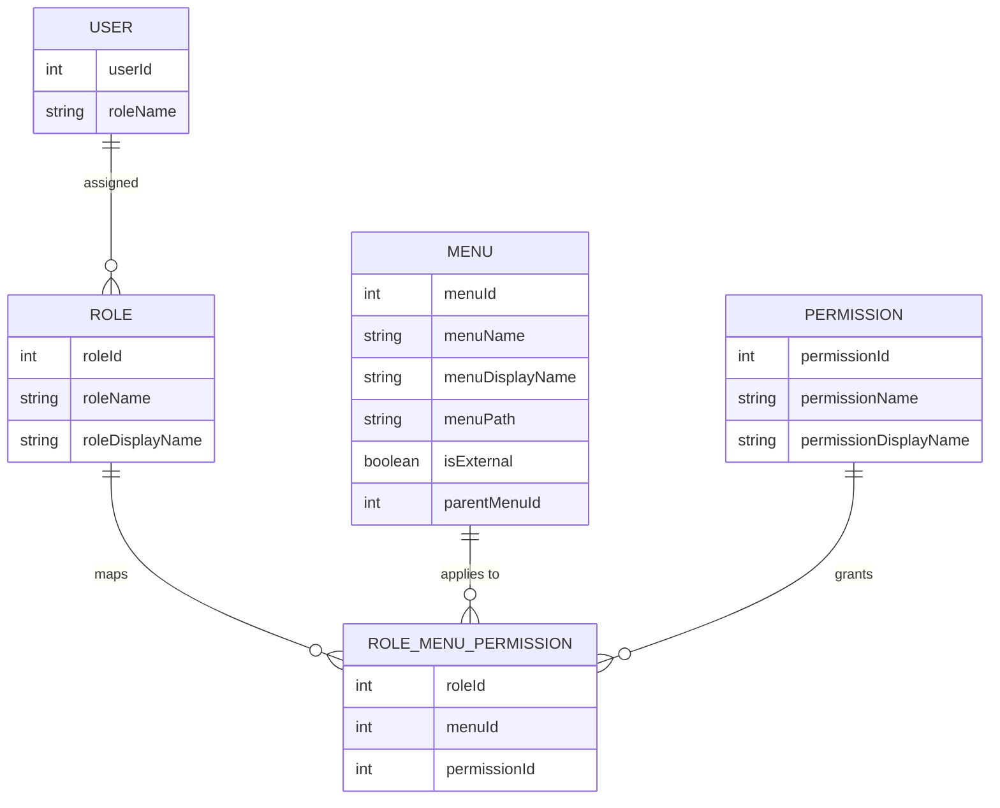
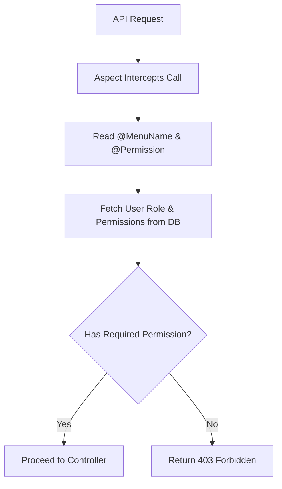

## 1. Database Tables and Example Data

### **User Table**

| userId | roleName     |
|--------|-------------|
| 1      | ADMIN       |
| 2      | CURATOR     |
| 3      | VIEWER     |

***

### **Role Table**

| roleId | roleName | roleDisplayName |
|--------|----------|-----------------|
| 1      | ADMIN    | Admin   |
| 2      | CURATOR  | Curator         |
| 3      | VIEWER  | Viewer        |

***

### **Menu Table**

| menuId | menuName | menuDisplayName | menuPath         | isExternal | parentMenuId |
|--------|----------|-----------------|------------------|------------|--------------|
| 1      | ROW      | Row             |                  | false      | 0            |
| 2      | ARENA    | Arena           |                  | false      | 0            |
| 3      | MANAGEMENT| Management      |                  | false      | 0            |
| 4      | ROLE     | Role            | admin/role       | false      | 3            |
| 5      | USER     | User            | admin/user       | false      | 3            |
| 6      | AIRFLOW  | Airflow         | admin/airflow    | true       | 3            |

***



### **Permission Table**

| permissionId | permissionName | permissionDisplayName |
|--------------|---------------|----------------------|
| 1            | READ          | View                 |
| 2            | CREATE        | Create               |
| 3            | UPDATE        | Update               |
| 4            | DELETE        | Delete               |

***


 - Permissions are hierarchically i.e READ < CREATE < UPDATE < DELETE thus 1 menu/sub menu does not need more than one permission
 - Higher permissions implicitly include lower ones. Example: if a role has CREATE, they automatically have READ.


### **Role_Menu_Permission Table**
This table maps which roles get which permission on which menu.

| roleId | menuId | permissionId |
|--------|--------|-------------|
| 1      | 2 (ARENA) | 1 (READ)    |
| 1      | 1 (ROW)    | 2 (CREATE)  |
| 2      | 6 (AIRFLOW)| 1 (READ)    |
| 3      | 5 (USER)   | 1 (READ)    |




***

## 2. Frontend Implementation

### **A. Dynamic Navbar Rendering**

- When a user logs in, frontend calls an API that returns all the allowed menus and permissions structured hierarchically—based on their role/user assignment (If user has permission for sub menu than main menu is also present api response).
- The main menu items such as ROW and ARENA are always rendered if the user has any permission for them.
- "Pseudo menus" (like `all_arena`, `create_arena`, `all_row`, `create_row`) are **NOT** present in the DB—they exist in frontend config, mapped to a permission/parent menu.
- Pseudo menus are UI-only elements for navigation convenience; they don’t represent backend APIs, so we don’t persist them in the DB.

**Example of frontend config (pseudo menu logic):**
```js
const pseudoMenus = {
  ARENA: [
    { name: "All Arena", route: "/arena", permission: "READ" },
    { name: "Create Arena", route: "/arena/create", permission: "CREATE" }
  ],
  ROW: [
    { name: "All Row", route: "/rows", permission: "READ" },
    { name: "Create Row", route: "/rows/create", permission: "CREATE" }
  ]
};
```

- When rendering the navbar:
  - Show ARENA if user has any permission (READ, CREATE) for ARENA.
  - Under ARENA, show "All Arena" if they have READ for ARENA; show "Create Arena" and "All Arena" if they have CREATE for ARENA (permissions are hierarchical so CREATE implies READ also).

***

### **B. Protected Route Wrapper**

- Every page is wrapped in a `<Protected>` React component:
  ```jsx
  <Protected component={CreateArenaPage} menu="ARENA" permission="CREATE"/>
  <Protected component={ArenaPage} menu="ARENA" permission="READ"/>

  ```
- Checks if the user has the required permission for that menu (from their loaded permissions).
- If not authorized, blocks access or redirects.

***


## 3. Backend Implementation

### **A. Controller-Level Annotations**

- Use custom annotations in Spring Boot:

```java
@RestController
@MenuName("ARENA") // class level: assigns the menu/category
public class ArenaController {
    @GetMapping
    @Permission("READ") // method level: assigns the required permission
    public List<Arena> getAllArena() { ... }

    @PostMapping
    @Permission("CREATE")
    public void createArena(@RequestBody Arena arena) { ... }
}
```

- The **@MenuName** annotation is always on the controller class; **@Permission** is always on the API method.

***

### **B. Aspect-based Authorization**

- Aspect intercepts API calls, reads the `@MenuName` and `@Permission` annotations.
- Looks up the currently logged-in user's roles and permissions using the `role_menu_permission` table.
- Checks hierarchical permission rules (CREATE implies READ).
- If the user has required permission for the menu, lets execution continue; otherwise returns an authorization error.


***



## 4. Role Management UI

- Admins see a permissions matrix where they can assign permissions per menu, per role:

| Menu        |Sub menu| View  | Create | Update | Delete |
|-------------|--------|-------|--------|--------|--------|
| ARENA       |        | ✅    | ✅    |        |        |
| ROW         |        |       | ✅     |        |        |
| MANAGEMENT  |  USER  | ✅    |        |        |        |
|             |  ROLE  | ✅    |        |        |        |
|             |  AIRFLOW  | ✅    |        |        |        |

***

## 5. Workflow Example

**Suppose a user with ADMIN role:**
- Has `CREATE` (implecitly `READ` also) on ARENA and `CREATE` on ROW.
- When logging in:
  - Frontend receives permissions: `{ ARENA: [READ, CREATE], ROW: [CREATE] }`.
  - Navbar renders "All Arena" and "Create Arena" under ARENA, "Create Row" under ROW.
- If user visits `/arena`, Protected checks for `READ` on ARENA—user is allowed.
- If user posts to `/arena` API, aspect checks for `CREATE` on ARENA—user is allowed.

***

